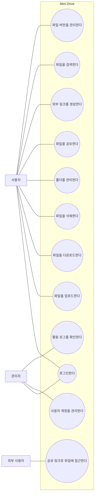
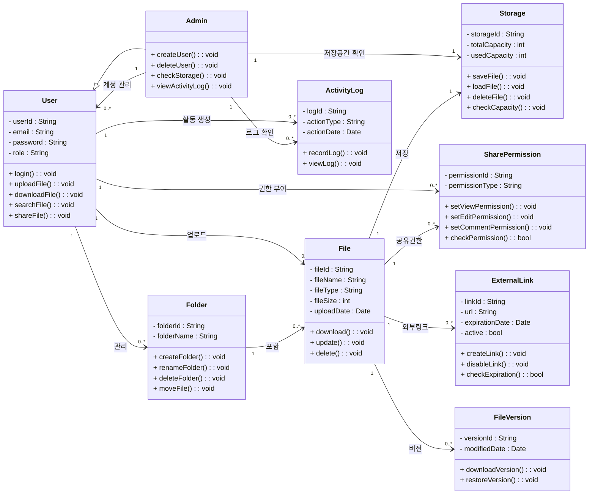
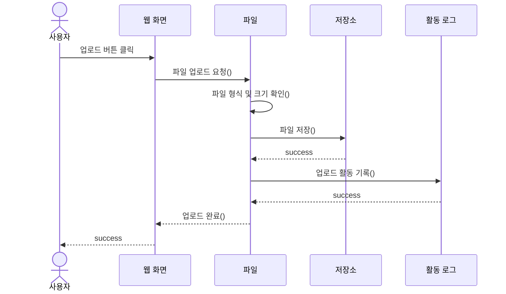
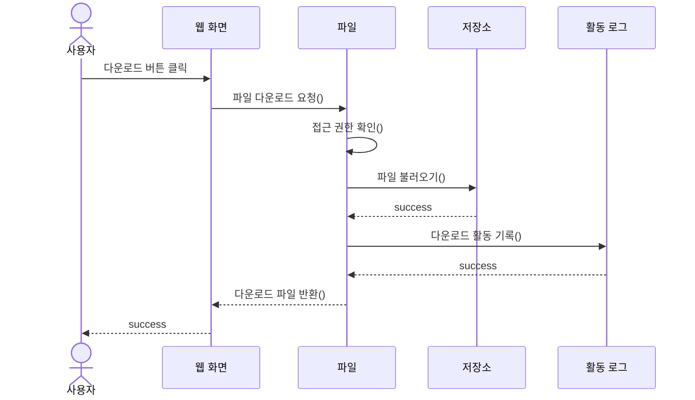
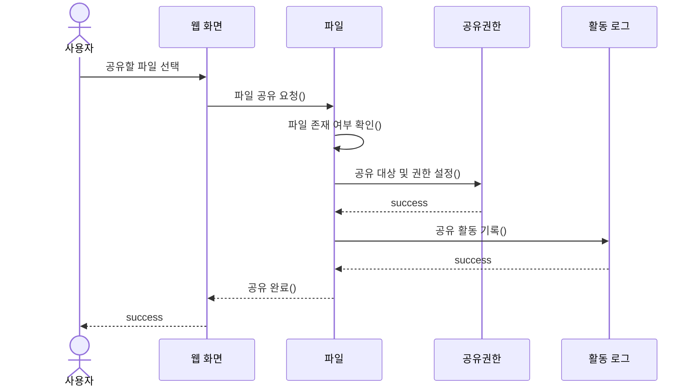
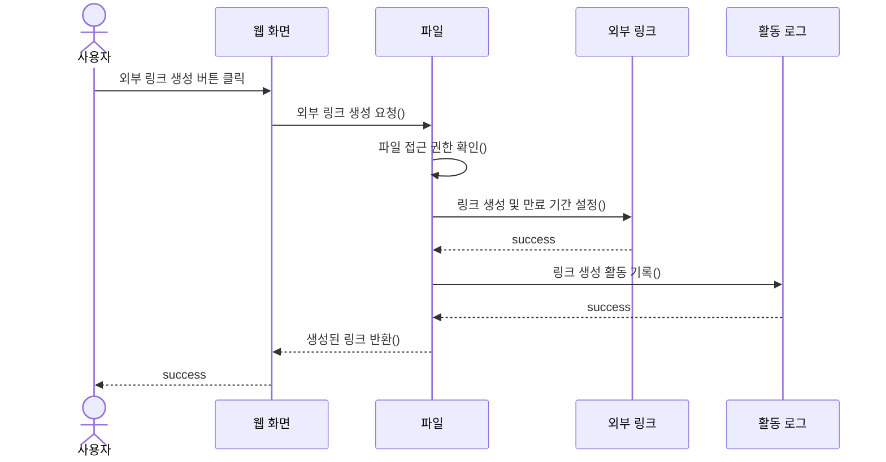
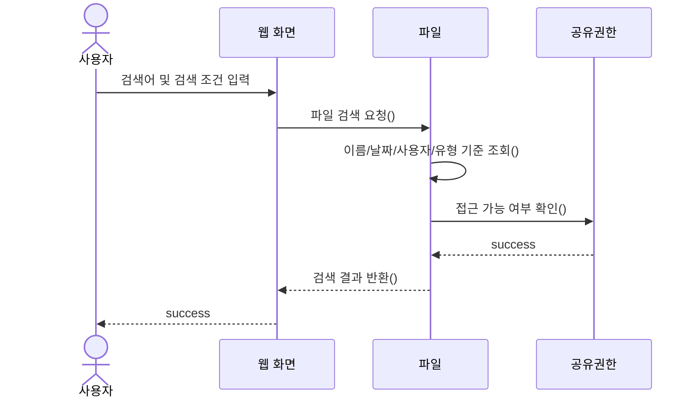
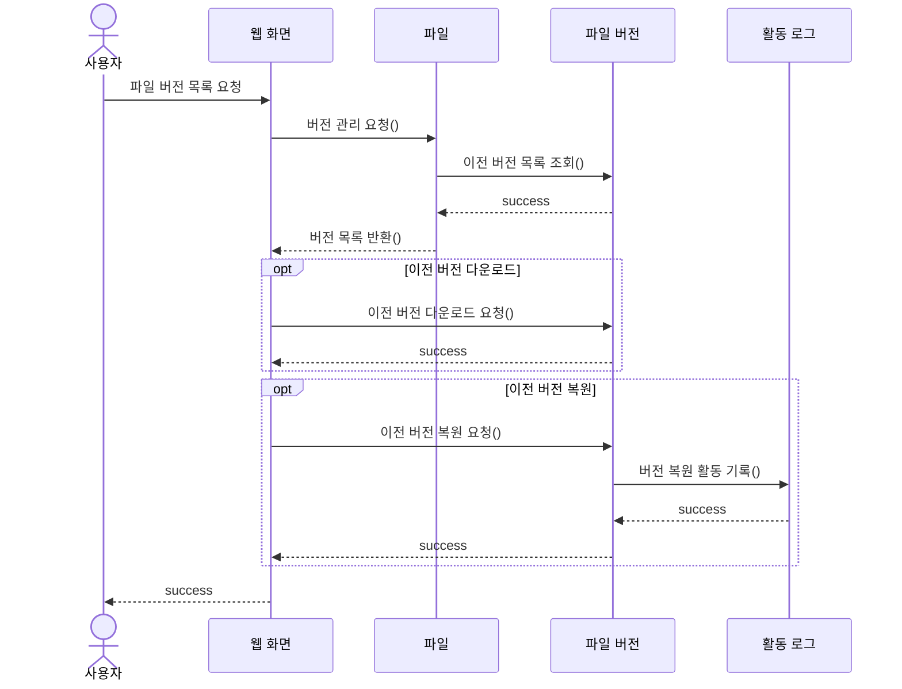
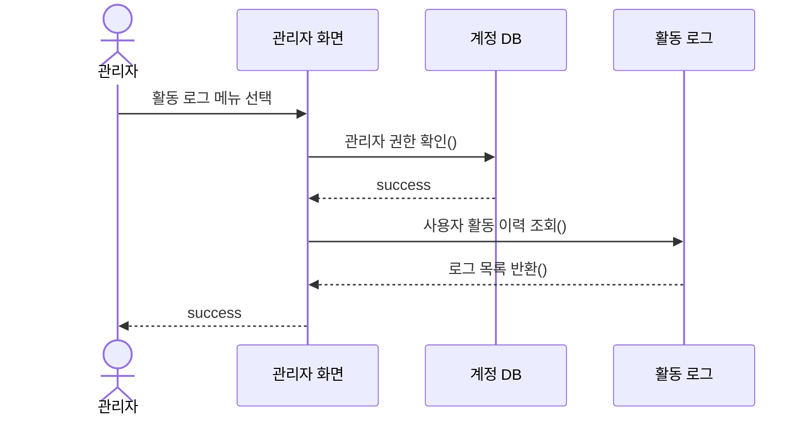

# Mini Drive 요구사항 분석서

# 목차

1. 서론  
   1.1 목적 및 범위  
   1.2 용어 정의  
   1.3 참조 문서  

2. 시스템 개요  
   2.1 소프트웨어 컨텍스트  
   2.2 기능 분류 및 설명  

3. 요구사항 명세  
   3.1 정적 분석  
   3.2 CRC 카드  
   3.3 동적 분석  

4. 인터페이스 분석  

5. 제약사항  

6. 요구사항 추적표  
   6.1 기능 요구사항 추적표  
   6.2 비기능 요구사항 및 제약사항 추적표  

7. 참고문헌 및 부록  

---

# 1. 서론

## 1.1 목적 및 범위

본 문서는 조직 내 협업을 위한 클라우드 파일 공유 시스템인 **Mini Drive**의 요구사항을 분석하기 위한 문서이다.

Mini Drive는 조직 내부 사용자가 파일을 중앙에서 관리하고, 업로드, 다운로드, 폴더 관리, 파일 공유, 외부 링크 공유, 검색, 버전 관리, 사용자 계정 관리, 보안 관리 기능을 사용할 수 있도록 지원하는 시스템이다.

본 문서에서는 기존 요구사항 정의서를 바탕으로 시스템의 주요 액터와 유스케이스를 식별하고, 정적 분석, CRC 카드, 동적 분석을 통해 요구사항을 객체지향 관점에서 분석한다.

---

## 1.2 용어 정의

| 용어 | 설명 |
|---|---|
| Mini Drive | 본 프로젝트에서 개발하는 클라우드 기반 파일 공유 시스템 |
| 사용자 | Mini Drive에 로그인하여 파일을 업로드, 다운로드, 공유하는 일반 사용자 |
| 관리자 | 사용자 계정, 저장 공간, 활동 로그 등을 관리하는 사용자 |
| 외부 사용자 | 외부 공유 링크를 통해 파일에 접근하는 사용자 |
| 파일 | Mini Drive에 업로드되어 저장되는 업무 자료 |
| 폴더 | 파일을 분류하고 관리하기 위한 저장 단위 |
| 파일 공유 | 특정 사용자에게 파일 접근 권한을 제공하는 기능 |
| 외부 링크 | 외부 사용자가 파일에 접근할 수 있도록 생성되는 공유 URL |
| 권한 | 파일에 대해 사용자가 수행할 수 있는 작업 범위 |
| 버전 관리 | 파일 수정 이력을 보관하고 이전 버전을 확인, 다운로드, 복원하는 기능 |
| 활동 로그 | 파일 조회, 다운로드, 수정, 공유 등 주요 사용자 활동 이력 |
| 유스케이스 | 액터가 시스템을 통해 수행하는 주요 기능 |
| CRC 카드 | 클래스의 책임과 협력 관계를 정리하는 객체지향 분석 도구 |

---

## 1.3 참조 문서

| 문서명 | 설명 |
|---|---|
| 요구사항정의서 | Mini Drive의 기능적, 비기능적, 인터페이스 요구사항을 정의한 문서 |
| ch08_객체지향 분석 강의자료 | 객체지향 분석, UML, 유스케이스 다이어그램, 클래스 다이어그램, 순차 다이어그램 작성 기준 |
| 샘플_요구사항분석서 | 요구사항 분석서 작성 양식 참고 문서 |

---

# 2. 시스템 개요

## 2.1 소프트웨어 컨텍스트

Mini Drive는 조직 내부 사용자의 파일 관리와 공유를 지원하는 웹 기반 클라우드 파일 공유 시스템이다.

사용자는 웹 브라우저를 통해 Mini Drive에 로그인한 후 파일 업로드, 다운로드, 폴더 관리, 파일 공유, 외부 링크 생성, 파일 검색, 버전 관리 기능을 사용할 수 있다. 관리자는 사용자 계정과 저장 공간을 관리하고, 보안 점검이 필요한 경우 활동 로그를 확인할 수 있다. 외부 사용자는 공유 링크를 통해 허용된 파일에 접근할 수 있다.

---

## 2.1.1 Actor Table

| Actor | Role |
|---|---|
| 사용자 | Mini Drive에 로그인하여 파일을 업로드, 다운로드, 검색, 공유하는 일반 사용자 |
| 관리자 | 사용자 계정 생성 및 삭제, 사용자별 저장 공간 확인, 활동 로그 확인을 수행하는 사용자 |
| 외부 사용자 | 외부 링크를 통해 공유 파일에 접근하는 사용자 |
| Mini Drive 시스템 | 파일 저장, 메타데이터 관리, 권한 확인, 버전 관리, 로그 기록을 수행하는 시스템 |

---

## 2.1.2 Use Case Diagram

---

## 2.2 기능 분류 및 설명

Mini Drive의 주요 기능은 사용자의 파일 관리 기능, 파일 공유 기능, 검색 및 버전 관리 기능, 관리자의 계정 및 로그 관리 기능으로 구분할 수 있다. 각 기능은 유스케이스로 정의하며, 유스케이스 설명서를 통해 액터의 행위와 시스템의 응답을 단계별로 정리한다.

---

## 2.2.1 Use Case Description

---

### Use Case Name : 로그인한다

| 항목 | 내용 |
|---|---|
| ID | UC01 |
| Importance Level | High |
| Primary Actor | 사용자, 관리자 |
| Use Case Type | Detail, Essential |
| Brief Description | 사용자가 이메일과 비밀번호를 입력하여 Mini Drive에 로그인하는 기능이다. |
| Stakeholders and Interests | 사용자는 본인 계정으로 파일 관리 기능을 사용하기를 원한다. 관리자는 관리자 권한으로 계정 및 로그 관리 기능을 사용하기를 원한다. |
| Trigger | 사용자가 로그인 화면에서 로그인 버튼을 누른다. |
| Association | 사용자, 관리자 |
| Include | 없음 |
| Extend | 없음 |
| Generalization | 없음 |

#### Normal Flow of Events

| 순서 | 액터의 행위 | 시스템의 응답 |
|---|---|---|
| 1 | 사용자는 로그인 화면에 접속한다. | 시스템은 이메일과 비밀번호 입력 화면을 제공한다. |
| 2 | 사용자는 이메일과 비밀번호를 입력한다. | 시스템은 입력값 형식을 확인한다. |
| 3 | 사용자는 로그인 버튼을 누른다. | 시스템은 계정 정보를 확인한다. |
| 4 | - | 로그인 성공 시 파일 목록 화면으로 이동한다. |

#### Alternate / Exceptional Flows

| 예외 상황 | 발생 지점 | 시스템의 처리 |
|---|---|---|
| 입력값 누락 | 2 | 시스템은 이메일 또는 비밀번호 입력을 요청하는 메시지를 출력한다. |
| 로그인 실패 | 3 | 시스템은 로그인 실패 메시지를 출력하고 로그인 화면을 유지한다. |
| 권한 없는 접근 | 4 | 시스템은 접근을 제한하고 로그인 화면으로 이동한다. |

---

### Use Case Name : 파일을 업로드한다

| 항목 | 내용 |
|---|---|
| ID | UC02 |
| Importance Level | High |
| Primary Actor | 사용자 |
| Use Case Type | Detail, Essential |
| Brief Description | 사용자가 업무 파일을 Mini Drive에 업로드하는 기능이다. |
| Stakeholders and Interests | 사용자는 업무 파일을 중앙 저장소에 저장하기를 원한다. 시스템은 파일과 메타데이터를 안정적으로 저장해야 한다. |
| Trigger | 사용자가 파일 업로드 버튼을 누른다. |
| Association | 사용자 |
| Include | 로그인한다 |
| Extend | 없음 |
| Generalization | 없음 |

#### Normal Flow of Events

| 순서 | 액터의 행위 | 시스템의 응답 |
|---|---|---|
| 1 | 사용자는 파일 목록 화면에서 업로드 버튼을 누른다. | 시스템은 파일 선택 창을 제공한다. |
| 2 | 사용자는 업로드할 파일을 선택한다. | 시스템은 파일 이름, 크기, 유형을 확인한다. |
| 3 | 사용자는 업로드를 요청한다. | 시스템은 파일 형식과 크기가 허용 범위에 있는지 확인한다. |
| 4 | - | 시스템은 파일 저장소에 파일을 저장한다. |
| 5 | - | 시스템은 파일 이름, 업로드 날짜, 파일 크기, 파일 유형, 업로드 사용자 정보를 저장한다. |
| 6 | - | 시스템은 업로드 완료 메시지를 출력한다. |

#### Alternate / Exceptional Flows

| 예외 상황 | 발생 지점 | 시스템의 처리 |
|---|---|---|
| 파일 선택 누락 | 2 | 시스템은 파일 선택 요청 메시지를 출력한다. |
| 지원하지 않는 파일 형식 | 3 | 시스템은 업로드 불가 메시지를 출력한다. |
| 파일 저장 실패 | 4 | 시스템은 업로드 실패 여부를 명확히 안내한다. |

---

### Use Case Name : 파일을 다운로드한다

| 항목 | 내용 |
|---|---|
| ID | UC03 |
| Importance Level | High |
| Primary Actor | 사용자 |
| Use Case Type | Detail, Essential |
| Brief Description | 사용자가 Mini Drive에 저장된 파일을 다운로드하는 기능이다. |
| Stakeholders and Interests | 사용자는 필요한 파일을 내려받기를 원한다. 시스템은 권한이 있는 사용자에게만 파일 다운로드를 허용해야 한다. |
| Trigger | 사용자가 파일 목록에서 다운로드 버튼을 누른다. |
| Association | 사용자 |
| Include | 로그인한다 |
| Extend | 없음 |
| Generalization | 없음 |

#### Normal Flow of Events

| 순서 | 액터의 행위 | 시스템의 응답 |
|---|---|---|
| 1 | 사용자는 파일 목록에서 다운로드할 파일을 선택한다. | 시스템은 파일 정보를 확인한다. |
| 2 | 사용자는 다운로드 버튼을 누른다. | 시스템은 사용자의 파일 접근 권한을 확인한다. |
| 3 | - | 권한이 있는 경우 시스템은 파일 다운로드를 제공한다. |
| 4 | - | 시스템은 다운로드 활동 로그를 기록한다. |

#### Alternate / Exceptional Flows

| 예외 상황 | 발생 지점 | 시스템의 처리 |
|---|---|---|
| 권한 없음 | 2 | 시스템은 파일 다운로드를 제한하고 접근 불가 메시지를 출력한다. |
| 파일 없음 | 1 | 시스템은 파일이 존재하지 않는다는 메시지를 출력한다. |
| 다운로드 실패 | 3 | 시스템은 다운로드 실패 메시지를 출력한다. |

---

### Use Case Name : 파일을 삭제한다

| 항목 | 내용 |
|---|---|
| ID | UC12 |
| Importance Level | Medium |
| Primary Actor | 사용자 |
| Use Case Type | Detail, Essential |
| Brief Description | 사용자가 Mini Drive에 저장된 파일을 삭제하는 기능이다. |
| Stakeholders and Interests | 사용자는 불필요한 파일을 정리하기를 원한다. 시스템은 삭제 요청 시 권한을 확인하고 파일 상태를 안전하게 변경해야 한다. |
| Trigger | 사용자가 파일 목록에서 삭제 버튼을 누른다. |
| Association | 사용자 |
| Include | 로그인한다 |
| Extend | 없음 |
| Generalization | 없음 |

#### Normal Flow of Events

| 순서 | 액터의 행위 | 시스템의 응답 |
|---|---|---|
| 1 | 사용자는 파일 목록에서 삭제할 파일을 선택한다. | 시스템은 파일 정보를 확인한다. |
| 2 | 사용자는 삭제 버튼을 누른다. | 시스템은 사용자의 파일 삭제 권한을 확인한다. |
| 3 | - | 권한이 있는 경우 시스템은 파일을 삭제 처리한다. |
| 4 | - | 시스템은 삭제 활동 로그를 기록한다. |
| 5 | - | 시스템은 삭제 완료 메시지를 출력한다. |

#### Alternate / Exceptional Flows

| 예외 상황 | 발생 지점 | 시스템의 처리 |
|---|---|---|
| 권한 없음 | 2 | 시스템은 파일 삭제를 제한하고 접근 불가 메시지를 출력한다. |
| 파일 없음 | 1 | 시스템은 파일이 존재하지 않는다는 메시지를 출력한다. |
| 삭제 실패 | 3 | 시스템은 삭제 실패 메시지를 출력한다. |

---

### Use Case Name : 폴더를 관리한다

| 항목 | 내용 |
|---|---|
| ID | UC04 |
| Importance Level | High |
| Primary Actor | 사용자 |
| Use Case Type | Detail, Essential |
| Brief Description | 사용자가 폴더를 생성, 이름 변경, 삭제하고 파일을 다른 폴더로 이동하는 기능이다. |
| Stakeholders and Interests | 사용자는 파일을 체계적으로 정리하기를 원한다. |
| Trigger | 사용자가 폴더 관리 기능을 선택한다. |
| Association | 사용자 |
| Include | 로그인한다 |
| Extend | 없음 |
| Generalization | 없음 |

#### Normal Flow of Events

| 순서 | 액터의 행위 | 시스템의 응답 |
|---|---|---|
| 1 | 사용자는 폴더 관리 메뉴를 선택한다. | 시스템은 현재 폴더 목록을 출력한다. |
| 2 | 사용자는 폴더 생성, 이름 변경, 삭제, 파일 이동 중 하나를 선택한다. | 시스템은 선택한 작업에 필요한 입력 화면을 제공한다. |
| 3 | 사용자는 작업 정보를 입력하고 실행한다. | 시스템은 폴더 정보를 변경한다. |
| 4 | - | 시스템은 변경된 폴더 목록을 출력한다. |

#### Alternate / Exceptional Flows

| 예외 상황 | 발생 지점 | 시스템의 처리 |
|---|---|---|
| 폴더명 누락 | 3 | 시스템은 폴더명 입력 요청 메시지를 출력한다. |
| 중복 폴더명 | 3 | 시스템은 중복 폴더명 안내 메시지를 출력한다. |
| 삭제 불가 폴더 | 3 | 시스템은 삭제 불가 사유를 안내한다. |

---

### Use Case Name : 파일을 공유한다

| 항목 | 내용 |
|---|---|
| ID | UC05 |
| Importance Level | High |
| Primary Actor | 사용자 |
| Use Case Type | Detail, Essential |
| Brief Description | 사용자가 특정 파일을 다른 사용자와 공유하고 보기, 수정, 댓글 권한을 설정하는 기능이다. |
| Stakeholders and Interests | 사용자는 협업을 위해 파일을 공유하기를 원한다. 시스템은 권한이 없는 사용자의 접근을 제한해야 한다. |
| Trigger | 사용자가 파일 공유 버튼을 누른다. |
| Association | 사용자 |
| Include | 로그인한다 |
| Extend | 외부 링크를 생성한다 |
| Generalization | 없음 |

#### Normal Flow of Events

| 순서 | 액터의 행위 | 시스템의 응답 |
|---|---|---|
| 1 | 사용자는 공유할 파일을 선택한다. | 시스템은 파일 정보를 확인한다. |
| 2 | 사용자는 공유 대상 사용자를 입력한다. | 시스템은 공유 대상 계정을 확인한다. |
| 3 | 사용자는 보기, 수정, 댓글 권한을 설정한다. | 시스템은 권한 설정값을 확인한다. |
| 4 | 사용자는 공유 버튼을 누른다. | 시스템은 공유 권한을 저장한다. |
| 5 | - | 시스템은 공유 완료 메시지를 출력한다. |

#### Alternate / Exceptional Flows

| 예외 상황 | 발생 지점 | 시스템의 처리 |
|---|---|---|
| 공유 대상 없음 | 2 | 시스템은 공유 대상 입력 요청 메시지를 출력한다. |
| 존재하지 않는 사용자 | 2 | 시스템은 사용자 확인 실패 메시지를 출력한다. |
| 권한 설정 누락 | 3 | 시스템은 기본 보기 권한을 적용하거나 권한 선택을 요청한다. |

---

### Use Case Name : 외부 링크를 생성한다

| 항목 | 내용 |
|---|---|
| ID | UC06 |
| Importance Level | High |
| Primary Actor | 사용자 |
| Use Case Type | Detail, Essential |
| Brief Description | 사용자가 외부 협력 업체와 파일을 공유하기 위해 외부 링크를 생성하는 기능이다. |
| Stakeholders and Interests | 사용자는 외부 사용자에게 파일을 전달하기를 원한다. 시스템은 링크 만료 기간과 비활성화 상태를 관리해야 한다. |
| Trigger | 사용자가 외부 링크 생성 버튼을 누른다. |
| Association | 사용자 |
| Include | 로그인한다 |
| Extend | 없음 |
| Generalization | 없음 |

#### Normal Flow of Events

| 순서 | 액터의 행위 | 시스템의 응답 |
|---|---|---|
| 1 | 사용자는 외부 링크를 생성할 파일을 선택한다. | 시스템은 파일 정보를 확인한다. |
| 2 | 사용자는 링크 만료 기간을 설정한다. | 시스템은 만료 기간 값을 확인한다. |
| 3 | 사용자는 링크 생성 버튼을 누른다. | 시스템은 외부 공유 링크를 생성한다. |
| 4 | - | 시스템은 생성된 링크를 화면에 출력한다. |

#### Alternate / Exceptional Flows

| 예외 상황 | 발생 지점 | 시스템의 처리 |
|---|---|---|
| 만료 기간 누락 | 2 | 시스템은 기본 만료 기간을 적용하거나 입력을 요청한다. |
| 링크 생성 실패 | 3 | 시스템은 링크 생성 실패 메시지를 출력한다. |
| 비활성화된 링크 접근 | 4 | 시스템은 접근 불가 메시지를 출력한다. |

---

### Use Case Name : 파일을 검색한다

| 항목 | 내용 |
|---|---|
| ID | UC07 |
| Importance Level | High |
| Primary Actor | 사용자 |
| Use Case Type | Detail, Essential |
| Brief Description | 사용자가 파일 이름, 날짜, 업로드 사용자, 파일 유형을 기준으로 파일을 검색하는 기능이다. |
| Stakeholders and Interests | 사용자는 필요한 파일을 빠르게 찾기를 원한다. |
| Trigger | 사용자가 검색어 또는 검색 조건을 입력한다. |
| Association | 사용자 |
| Include | 로그인한다 |
| Extend | 없음 |
| Generalization | 없음 |

#### Normal Flow of Events

| 순서 | 액터의 행위 | 시스템의 응답 |
|---|---|---|
| 1 | 사용자는 검색 화면에 접속한다. | 시스템은 검색어와 검색 조건 입력 화면을 제공한다. |
| 2 | 사용자는 파일 이름, 날짜, 사용자, 파일 유형 중 조건을 입력한다. | 시스템은 입력된 조건을 확인한다. |
| 3 | 사용자는 검색 버튼을 누른다. | 시스템은 조건에 맞는 파일 목록을 조회한다. |
| 4 | - | 시스템은 검색 결과를 화면에 출력한다. |

#### Alternate / Exceptional Flows

| 예외 상황 | 발생 지점 | 시스템의 처리 |
|---|---|---|
| 검색 조건 없음 | 2 | 시스템은 전체 파일 목록 또는 조건 입력 요청 메시지를 출력한다. |
| 검색 결과 없음 | 3 | 시스템은 검색 결과가 없다는 메시지를 출력한다. |
| 검색 처리 실패 | 3 | 시스템은 검색 실패 메시지를 출력한다. |

---

### Use Case Name : 파일 버전을 관리한다

| 항목 | 내용 |
|---|---|
| ID | UC08 |
| Importance Level | Medium |
| Primary Actor | 사용자 |
| Use Case Type | Detail, Essential |
| Brief Description | 사용자가 파일의 이전 버전 목록을 확인하고, 이전 버전을 다운로드하거나 복원하는 기능이다. |
| Stakeholders and Interests | 사용자는 파일 수정 이력을 확인하고 필요한 경우 이전 버전으로 복원하기를 원한다. |
| Trigger | 사용자가 파일 버전 목록 보기 버튼을 누른다. |
| Association | 사용자 |
| Include | 로그인한다 |
| Extend | 없음 |
| Generalization | 없음 |

#### Normal Flow of Events

| 순서 | 액터의 행위 | 시스템의 응답 |
|---|---|---|
| 1 | 사용자는 버전 관리를 수행할 파일을 선택한다. | 시스템은 파일 정보를 확인한다. |
| 2 | 사용자는 버전 목록 보기 버튼을 누른다. | 시스템은 해당 파일의 이전 버전 목록을 조회한다. |
| 3 | 사용자는 이전 버전 다운로드 또는 복원을 선택한다. | 시스템은 선택한 작업을 수행한다. |
| 4 | - | 시스템은 작업 결과를 화면에 출력한다. |

#### Alternate / Exceptional Flows

| 예외 상황 | 발생 지점 | 시스템의 처리 |
|---|---|---|
| 이전 버전 없음 | 2 | 시스템은 이전 버전이 없다는 메시지를 출력한다. |
| 복원 실패 | 3 | 시스템은 복원 실패 메시지를 출력한다. |
| 권한 없음 | 3 | 시스템은 버전 다운로드 또는 복원을 제한한다. |

---

### Use Case Name : 사용자 계정을 관리한다

| 항목 | 내용 |
|---|---|
| ID | UC09 |
| Importance Level | Medium |
| Primary Actor | 관리자 |
| Use Case Type | Detail, Essential |
| Brief Description | 관리자가 사용자 계정을 생성하거나 삭제하고 사용자별 저장 공간을 확인하는 기능이다. |
| Stakeholders and Interests | 관리자는 조직 내부 사용자의 계정과 저장 공간을 관리하기를 원한다. |
| Trigger | 관리자가 관리자용 계정 관리 화면에 접속한다. |
| Association | 관리자 |
| Include | 로그인한다 |
| Extend | 없음 |
| Generalization | 없음 |

#### Normal Flow of Events

| 순서 | 액터의 행위 | 시스템의 응답 |
|---|---|---|
| 1 | 관리자는 관리자용 계정 관리 화면에 접속한다. | 시스템은 사용자 목록을 출력한다. |
| 2 | 관리자는 계정 생성, 삭제, 저장 공간 확인 중 하나를 선택한다. | 시스템은 선택한 작업 화면을 제공한다. |
| 3 | 관리자는 필요한 정보를 입력하거나 사용자를 선택한다. | 시스템은 계정 정보를 처리한다. |
| 4 | - | 시스템은 처리 결과를 화면에 출력한다. |

#### Alternate / Exceptional Flows

| 예외 상황 | 발생 지점 | 시스템의 처리 |
|---|---|---|
| 관리자 권한 없음 | 1 | 시스템은 관리자 화면 접근을 제한한다. |
| 중복 계정 | 3 | 시스템은 계정 생성 실패 메시지를 출력한다. |
| 삭제 불가 계정 | 3 | 시스템은 삭제 불가 사유를 안내한다. |

---

### Use Case Name : 활동 로그를 확인한다

| 항목 | 내용 |
|---|---|
| ID | UC10 |
| Importance Level | Medium |
| Primary Actor | 관리자 |
| Use Case Type | Detail, Essential |
| Brief Description | 관리자가 파일 조회, 다운로드, 수정, 공유 등 주요 사용자 활동 이력을 확인하는 기능이다. |
| Stakeholders and Interests | 관리자는 보안 점검이 필요한 경우 사용자 활동 이력과 파일 접근 로그를 확인하기를 원한다. |
| Trigger | 관리자가 활동 로그 확인 메뉴를 선택한다. |
| Association | 관리자 |
| Include | 로그인한다 |
| Extend | 없음 |
| Generalization | 없음 |

#### Normal Flow of Events

| 순서 | 액터의 행위 | 시스템의 응답 |
|---|---|---|
| 1 | 관리자는 활동 로그 메뉴를 선택한다. | 시스템은 로그 검색 조건 화면을 제공한다. |
| 2 | 관리자는 사용자, 기간, 활동 유형을 선택한다. | 시스템은 검색 조건을 확인한다. |
| 3 | 관리자는 조회 버튼을 누른다. | 시스템은 조건에 맞는 활동 로그를 조회한다. |
| 4 | - | 시스템은 활동 로그 목록을 화면에 출력한다. |

#### Alternate / Exceptional Flows

| 예외 상황 | 발생 지점 | 시스템의 처리 |
|---|---|---|
| 관리자 권한 없음 | 1 | 시스템은 접근을 제한한다. |
| 조회 결과 없음 | 3 | 시스템은 조회 결과가 없다는 메시지를 출력한다. |
| 로그 조회 실패 | 3 | 시스템은 로그 조회 실패 메시지를 출력한다. |

---

### Use Case Name : 공유 링크로 파일에 접근한다

| 항목 | 내용 |
|---|---|
| ID | UC11 |
| Importance Level | Medium |
| Primary Actor | 외부 사용자 |
| Use Case Type | Detail, Essential |
| Brief Description | 외부 사용자가 공유 링크를 통해 허용된 파일에 접근하는 기능이다. |
| Stakeholders and Interests | 외부 사용자는 공유받은 링크를 통해 파일을 확인하기를 원한다. 시스템은 링크의 만료 여부와 활성 상태를 확인해야 한다. |
| Trigger | 외부 사용자가 공유 링크에 접속한다. |
| Association | 외부 사용자 |
| Include | 없음 |
| Extend | 없음 |
| Generalization | 없음 |

#### Normal Flow of Events

| 순서 | 액터의 행위 | 시스템의 응답 |
|---|---|---|
| 1 | 외부 사용자는 공유 링크에 접속한다. | 시스템은 링크 정보를 확인한다. |
| 2 | - | 시스템은 링크의 활성 상태와 만료 기간을 확인한다. |
| 3 | - | 링크가 유효한 경우 시스템은 공유 파일 접근 화면을 제공한다. |
| 4 | 외부 사용자는 파일을 확인하거나 다운로드한다. | 시스템은 허용된 범위 내에서 파일 접근을 제공한다. |

#### Alternate / Exceptional Flows

| 예외 상황 | 발생 지점 | 시스템의 처리 |
|---|---|---|
| 만료된 링크 | 2 | 시스템은 링크가 만료되었다는 메시지를 출력한다. |
| 비활성화된 링크 | 2 | 시스템은 접근 불가 메시지를 출력한다. |
| 파일 없음 | 3 | 시스템은 파일이 존재하지 않는다는 메시지를 출력한다. |

---

# 3. 요구사항 명세

## 3.1 정적 분석

정적 분석은 Mini Drive 시스템에서 사용되는 주요 클래스와 클래스 간의 관계를 분석하는 과정이다. 본 시스템에서는 파일 관리와 공유 기능을 중심으로 사용자, 관리자, 파일, 폴더, 공유권한, 외부링크, 파일버전, 활동로그, 저장소 클래스를 식별하였다. 사용자는 파일을 업로드, 다운로드, 검색, 공유하며, 관리자는 사용자 계정과 활동 로그를 관리한다. 파일은 폴더, 공유권한, 외부링크, 파일버전, 저장소와 연결되어 Mini Drive의 핵심 데이터로 사용된다.

---

## 3.2 CRC 카드

CRC 카드는 클래스가 담당해야 하는 책임과 다른 클래스와의 협력 관계를 정리하기 위한 것이다. 본 문서에서는 정적 분석에서 식별한 주요 클래스를 기준으로 CRC 카드를 작성하였다.

---

### Class Name : User

| 항목 | 내용 |
|---|---|
| Class Name | User |
| ID | C_01 |
| Type | Concrete, Domain |
| Description | Mini Drive를 사용하는 일반 사용자를 나타낸다. |
| Associated Use Case | UC01, UC02, UC03, UC04, UC05, UC06, UC07, UC08, UC12 |
| Responsibilities | 로그인, 파일 업로드, 파일 다운로드, 파일 삭제, 파일 검색, 파일 공유, 폴더 관리 |
| Collaborators | File, Folder, SharePermission, ExternalLink, FileVersion, ActivityLog |

| 구분 | 내용 |
|---|---|
| Attributes | userId, email, password, role |
| Operations | login(), uploadFile(), downloadFile(), deleteFile(), searchFile(), shareFile() |
| Relationships | 사용자는 파일을 업로드하고 폴더를 관리하며, 파일 공유 권한과 활동 로그를 생성한다. |

---

### Class Name : Admin

| 항목 | 내용 |
|---|---|
| Class Name | Admin |
| ID | C_02 |
| Type | Concrete, Domain |
| Description | Mini Drive의 사용자 계정과 저장 공간, 활동 로그를 관리하는 관리자를 나타낸다. |
| Associated Use Case | UC01, UC09, UC10 |
| Responsibilities | 사용자 계정 생성, 사용자 계정 삭제, 저장 공간 확인, 활동 로그 확인 |
| Collaborators | User, Storage, ActivityLog |

| 구분 | 내용 |
|---|---|
| Attributes | userId, email, password, role |
| Operations | createUser(), deleteUser(), checkStorage(), viewActivityLog() |
| Relationships | 관리자는 User를 상속받으며, 일반 사용자보다 확장된 관리 기능을 수행한다. |

---

### Class Name : File

| 항목 | 내용 |
|---|---|
| Class Name | File |
| ID | C_03 |
| Type | Concrete, Domain |
| Description | Mini Drive에 업로드되어 저장되는 업무 파일을 나타낸다. |
| Associated Use Case | UC02, UC03, UC05, UC06, UC07, UC08, UC12 |
| Responsibilities | 파일 정보 저장, 다운로드 제공, 수정 처리, 삭제 처리, 버전 관리 대상 제공 |
| Collaborators | User, Folder, SharePermission, ExternalLink, FileVersion, Storage |

| 구분 | 내용 |
|---|---|
| Attributes | fileId, fileName, fileType, fileSize, uploadDate |
| Operations | download(), update(), delete() |
| Relationships | 파일은 사용자에 의해 업로드되고, 폴더에 포함되며, 공유권한, 외부링크, 파일버전과 연결된다. |

---

### Class Name : Folder

| 항목 | 내용 |
|---|---|
| Class Name | Folder |
| ID | C_04 |
| Type | Concrete, Domain |
| Description | 파일을 분류하고 관리하기 위한 폴더를 나타낸다. |
| Associated Use Case | UC04 |
| Responsibilities | 폴더 생성, 폴더 이름 변경, 폴더 삭제, 파일 이동 |
| Collaborators | User, File |

| 구분 | 내용 |
|---|---|
| Attributes | folderId, folderName |
| Operations | createFolder(), renameFolder(), deleteFolder(), moveFile() |
| Relationships | 사용자는 폴더를 관리하며, 하나의 폴더는 여러 파일을 포함할 수 있다. |

---

### Class Name : SharePermission

| 항목 | 내용 |
|---|---|
| Class Name | SharePermission |
| ID | C_05 |
| Type | Concrete, Domain |
| Description | 파일 공유 시 부여되는 보기, 수정, 댓글 권한을 나타낸다. |
| Associated Use Case | UC05, UC03 |
| Responsibilities | 보기 권한 설정, 수정 권한 설정, 댓글 권한 설정, 접근 권한 확인 |
| Collaborators | User, File |

| 구분 | 내용 |
|---|---|
| Attributes | permissionId, permissionType |
| Operations | setViewPermission(), setEditPermission(), setCommentPermission(), checkPermission() |
| Relationships | 공유권한은 파일과 사용자 사이의 접근 가능 범위를 정의한다. |

---

### Class Name : ExternalLink

| 항목 | 내용 |
|---|---|
| Class Name | ExternalLink |
| ID | C_06 |
| Type | Concrete, Domain |
| Description | 외부 사용자가 파일에 접근할 수 있도록 생성되는 공유 링크를 나타낸다. |
| Associated Use Case | UC06, UC11 |
| Responsibilities | 외부 링크 생성, 외부 링크 비활성화, 만료 기간 확인 |
| Collaborators | User, File |

| 구분 | 내용 |
|---|---|
| Attributes | linkId, url, expirationDate, active |
| Operations | createLink(), disableLink(), checkExpiration() |
| Relationships | 외부 링크는 특정 파일에 연결되며, 만료 기간과 활성 상태를 가진다. |

---

### Class Name : FileVersion

| 항목 | 내용 |
|---|---|
| Class Name | FileVersion |
| ID | C_07 |
| Type | Concrete, Domain |
| Description | 파일이 수정될 때 저장되는 이전 버전 정보를 나타낸다. |
| Associated Use Case | UC08 |
| Responsibilities | 이전 버전 목록 제공, 이전 버전 다운로드, 이전 버전 복원 |
| Collaborators | File, User |

| 구분 | 내용 |
|---|---|
| Attributes | versionId, modifiedDate |
| Operations | downloadVersion(), restoreVersion() |
| Relationships | 하나의 파일은 여러 개의 파일 버전을 가질 수 있다. |

---

### Class Name : ActivityLog

| 항목 | 내용 |
|---|---|
| Class Name | ActivityLog |
| ID | C_08 |
| Type | Concrete, Domain |
| Description | 파일 조회, 다운로드, 수정, 공유 등 주요 사용자 활동 이력을 나타낸다. |
| Associated Use Case | UC03, UC05, UC06, UC08, UC10 |
| Responsibilities | 사용자 활동 기록, 활동 로그 조회 |
| Collaborators | User, Admin, File |

| 구분 | 내용 |
|---|---|
| Attributes | logId, actionType, actionDate |
| Operations | recordLog(), viewLog() |
| Relationships | 사용자의 주요 활동은 활동 로그로 기록되며, 관리자는 이를 조회할 수 있다. |

---

### Class Name : Storage

| 항목 | 내용 |
|---|---|
| Class Name | Storage |
| ID | C_09 |
| Type | Concrete, Domain |
| Description | Mini Drive의 파일 저장 공간을 나타낸다. |
| Associated Use Case | UC02, UC03, UC09 |
| Responsibilities | 파일 저장, 파일 불러오기, 파일 삭제, 저장 공간 확인 |
| Collaborators | File, Admin |

| 구분 | 내용 |
|---|---|
| Attributes | storageId, totalCapacity, usedCapacity |
| Operations | saveFile(), loadFile(), deleteFile(), checkCapacity() |
| Relationships | 저장소는 파일을 보관하며, 관리자는 사용자별 저장 공간을 확인할 수 있다. |

---

## 3.3 동적 분석

동적 분석은 주요 유스케이스가 실행될 때 액터와 객체가 어떤 순서로 상호작용하는지 나타낸다. 본 문서에서는 Mini Drive의 핵심 기능인 파일 업로드, 파일 다운로드, 파일 공유, 외부 링크 생성, 파일 검색, 파일 버전 관리, 활동 로그 확인을 중심으로 순차 다이어그램을 작성하였다.

---

## 3.3.1 파일을 업로드한다

---

## 3.3.2 파일을 다운로드한다

---

## 3.3.3 파일을 공유한다

---

## 3.3.4 외부 링크를 생성한다

---

## 3.3.5 파일을 검색한다

---

## 3.3.6 파일 버전을 관리한다

---

## 3.3.7 활동 로그를 확인한다

---

# 4. 인터페이스 분석

Mini Drive는 웹 브라우저를 통해 접근하는 시스템으로, 사용자가 별도의 프로그램 설치 없이 주요 기능을 사용할 수 있도록 화면을 제공해야 한다. 인터페이스는 일반 사용자가 사용하는 파일 관리 화면과 관리자가 사용하는 관리 화면으로 구분된다.

---

## 4.1 사용자 화면 인터페이스

| 화면 | 설명 | 관련 요구사항 |
|---|---|---|
| 로그인 화면 | 이메일과 비밀번호를 입력하여 로그인하는 화면 | IR-001, FR-027, FR-028 |
| 파일 목록 화면 | 사용자가 업로드한 파일과 공유받은 파일을 확인하는 화면 | IR-002 |
| 파일 업로드/다운로드 화면 | 파일 업로드와 다운로드 기능을 수행하는 화면 | IR-003, FR-001, FR-002 |
| 폴더 관리 화면 | 폴더 생성, 이름 변경, 삭제, 파일 이동을 수행하는 화면 | IR-004, FR-005 ~ FR-009 |
| 파일 공유 및 권한 설정 화면 | 공유 대상과 보기, 수정, 댓글 권한을 설정하는 화면 | IR-005, FR-010 ~ FR-014 |
| 외부 링크 생성 화면 | 외부 링크 생성, 만료 기간 설정, 링크 비활성화를 수행하는 화면 | IR-006, FR-015 ~ FR-018 |
| 파일 검색 화면 | 파일 이름, 날짜, 사용자, 파일 유형 기준으로 검색하는 화면 | IR-007, FR-019 ~ FR-022 |
| 파일 버전 목록 화면 | 이전 버전 확인, 다운로드, 복원을 수행하는 화면 | IR-008, FR-023 ~ FR-026 |
| 관리자 계정 관리 화면 | 사용자 계정 생성, 삭제, 저장 공간 확인을 수행하는 화면 | IR-009, FR-029, FR-030 |

---

## 4.2 외부 시스템 인터페이스

| 인터페이스 | 설명 | 관련 요구사항 |
|---|---|---|
| 외부 공유 URL | 외부 사용자가 공유 링크를 통해 파일에 접근할 수 있는 URL을 제공한다. | IR-010, FR-015, FR-016 |
| 외부 인증 시스템 연동 가능 구조 | 향후 조직의 외부 인증 시스템과 연동할 수 있도록 확장 가능한 구조를 고려한다. | IR-011 |
| 외부 저장소 또는 확장 기능 연동 가능 구조 | 향후 공동 편집, 자동 분류, AI 기반 검색 기능을 추가할 수 있도록 확장성을 고려한다. | NFR-021 |

---

# 5. 제약사항

Mini Drive는 조직 내부 협업을 지원하기 위한 웹 기반 파일 공유 시스템이므로, 운영 환경, 보안, 성능, 확장성 측면에서 다음과 같은 제약사항을 가진다.

| ID | 제약사항 | 관련 요구사항 |
|---|---|---|
| CR-001 | Mini Drive는 조직 내부 사용자를 주요 대상으로 한다. | CR-002 |
| CR-002 | 시스템은 웹 브라우저를 통해 접근할 수 있어야 한다. | NFR-001 |
| CR-003 | 시스템은 별도의 프로그램 설치 없이 사용할 수 있도록 설계한다. | NFR-002 |
| CR-004 | 시스템은 일반적인 업무 환경에서 사용하는 문서, 이미지, PDF, 압축 파일 등을 지원해야 한다. | NFR-003, FR-004 |
| CR-005 | 시스템은 약 200명 규모의 조직에서 사용할 수 있도록 설계한다. | NFR-004 |
| CR-006 | 시스템은 권한 기반 접근 제어를 제공해야 한다. | NFR-009, FR-031 |
| CR-007 | 외부 공유 링크는 만료 기간과 비활성화 상태를 관리할 수 있어야 한다. | NFR-011, FR-017, FR-018 |
| CR-008 | 주요 장애 발생 시 24시간 이내 복구를 목표로 한다. | NFR-019 |
| CR-009 | 향후 공동 편집, 자동 분류, AI 기반 검색 기능을 추가할 수 있도록 확장성을 고려한다. | NFR-021 |
| CR-010 | 시스템은 파일 검색 결과를 3초 이내에 제공하는 것을 목표로 한다. | NFR-005 |
| CR-011 | 시스템은 100MB 이하의 파일 업로드를 10초 이내에 처리하는 것을 목표로 한다. | NFR-006 |
| CR-012 | 시스템은 100MB 이하의 파일 다운로드를 10초 이내에 처리하는 것을 목표로 한다. | NFR-007 |

---

# 6. 요구사항 추적표

요구사항 추적표는 기능 요구사항이 어떤 유스케이스와 연결되는지 확인하기 위한 표이다. 이를 통해 요구사항 정의서의 기능 요구사항이 분석 산출물에 반영되었는지 점검할 수 있다.

---

## 6.1 기능 요구사항 추적표

| 요구사항 | UC01 로그인 | UC02 파일 업로드 | UC03 파일 다운로드 | UC12 파일 삭제 | UC04 폴더 관리 | UC05 파일 공유 | UC06 외부 링크 생성 | UC07 파일 검색 | UC08 버전 관리 | UC09 계정 관리 | UC10 로그 확인 | UC11 링크 접근 |
|---|---|---|---|---|---|---|---|---|---|---|---|---|
| FR-001 |  | O |  |  |  |  |  |  |  |  |  |  |
| FR-002 |  |  | O |  |  |  |  |  |  |  |  |  |
| FR-003 |  | O |  |  |  |  |  |  |  |  |  |  |
| FR-004 |  | O |  |  |  |  |  |  |  |  |  |  |
| FR-005 |  |  |  |  | O |  |  |  |  |  |  |  |
| FR-006 |  |  |  |  | O |  |  |  |  |  |  |  |
| FR-007 |  |  |  |  | O |  |  |  |  |  |  |  |
| FR-008 |  |  |  |  | O |  |  |  |  |  |  |  |
| FR-009 |  |  |  |  | O |  |  |  |  |  |  |  |
| FR-010 |  |  |  |  |  | O |  |  |  |  |  |  |
| FR-011 |  |  |  |  |  | O |  |  |  |  |  |  |
| FR-012 |  |  |  |  |  | O |  |  |  |  |  |  |
| FR-013 |  |  |  |  |  | O |  |  |  |  |  |  |
| FR-014 |  |  |  |  |  | O |  |  |  |  |  | O |
| FR-015 |  |  |  |  |  |  | O |  |  |  |  |  |
| FR-016 |  |  |  |  |  |  |  |  |  |  |  | O |
| FR-017 |  |  |  |  |  |  | O |  |  |  |  |  |
| FR-018 |  |  |  |  |  |  | O |  |  |  |  |  |
| FR-019 |  |  |  |  |  |  |  | O |  |  |  |  |
| FR-020 |  |  |  |  |  |  |  | O |  |  |  |  |
| FR-021 |  |  |  |  |  |  |  | O |  |  |  |  |
| FR-022 |  |  |  |  |  |  |  | O |  |  |  |  |
| FR-023 |  |  |  |  |  |  |  |  | O |  |  |  |
| FR-024 |  |  |  |  |  |  |  |  | O |  |  |  |
| FR-025 |  |  |  |  |  |  |  |  | O |  |  |  |
| FR-026 |  |  |  |  |  |  |  |  | O |  |  |  |
| FR-027 | O |  |  |  |  |  |  |  |  |  |  |  |
| FR-028 | O | O | O | O | O | O | O | O | O | O | O |  |
| FR-029 |  |  |  |  |  |  |  |  |  | O |  |  |
| FR-030 |  |  |  |  |  |  |  |  |  | O |  |  |
| FR-031 |  |  | O |  |  | O |  |  |  |  |  | O |
| FR-032 |  |  |  |  |  |  | O |  |  |  |  | O |
| FR-033 |  |  | O |  |  |  |  |  |  |  |  |  |
| FR-034 |  |  |  | O | O |  |  |  | O |  |  |  |
| FR-035 |  | O | O | O |  | O | O |  | O |  | O |  |
| FR-036 |  |  |  |  |  |  |  |  |  |  | O |  |

---

## 6.2 비기능 요구사항 및 제약사항 추적표

비기능 요구사항과 제약사항은 시스템 전체 품질과 관련되므로, 별도의 추적표로 정리한다.

| 요구사항 | 분류 | 관련 항목 | 확인 기준 |
|---|---|---|---|
| NFR-001 ~ NFR-003 | 운영 환경 | 인터페이스 분석, 제약사항 | 웹 브라우저에서 별도 설치 없이 주요 기능을 사용할 수 있어야 한다. |
| NFR-004 | 성능 | 제약사항 | 약 200명 규모의 조직 사용자를 고려하여 설계해야 한다. |
| NFR-005 | 성능 | 파일 검색 | 검색 결과를 3초 이내에 제공하는 것을 목표로 한다. |
| NFR-006 ~ NFR-007 | 성능 | 파일 업로드/다운로드 | 100MB 이하 파일의 업로드와 다운로드를 10초 이내에 처리하는 것을 목표로 한다. |
| NFR-008 ~ NFR-012 | 보안 | 로그인, 권한 관리, 외부 링크 | 로그인 인증, 권한 기반 접근 제어, 외부 링크 만료 기능을 제공해야 한다. |
| NFR-016 ~ NFR-019 | 신뢰성 | 오류 처리, 복구, 제약사항 | 오류 발생 시 실패 여부를 안내하고, 주요 장애는 24시간 이내 복구를 목표로 한다. |
| NFR-020 | 유지보수성 | 정적 분석, CRC 카드 | 주요 기능을 모듈별로 구분하여 설계해야 한다. |
| NFR-021 | 확장성 | 인터페이스 분석, 제약사항 | 향후 공동 편집, 자동 분류, AI 기반 검색 기능 추가를 고려해야 한다. |

---

# 7. 참고문헌 및 부록

## 7.1 참고문헌

본 문서에서 참고한 문서는 1.3 참조 문서에 명시하였다.

## 7.2 부록

해당 없음
