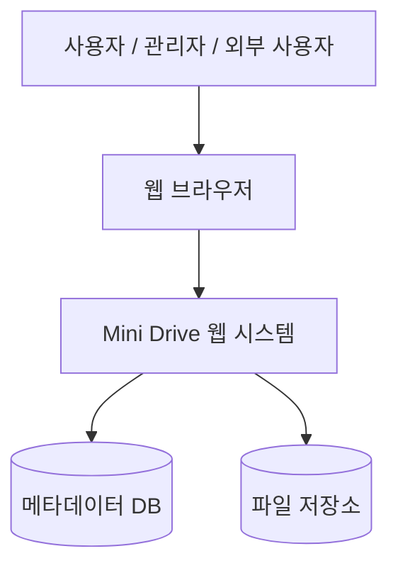

# Mini Drive 테스트 결과 보고서

---

# 목차

1. 서론
   1.1 문서 목적 및 범위
   1.2 프로젝트 개요
   1.3 용어 정의
   1.4 참조 문서

2. 테스트 개요
   2.1 테스트 범위
   2.2 테스트 항목 및 통과 기준

3. 테스트 케이스
   3.1 테스트 케이스 선정
   3.2 테스트 케이스 유형
   3.3 테스트 케이스 목록

4. 테스트 예외사항
   4.1 중단 기준과 재개 조건

5. 테스트 환경
   5.1 테스트 환경 구성도

6. 테스트 결과
   6.1 로그인 기능 테스트 결과
   6.2 파일 업로드 기능 테스트 결과
   6.3 파일 다운로드 기능 테스트 결과
   6.4 파일 삭제 기능 테스트 결과
   6.5 폴더 관리 기능 테스트 결과
   6.6 파일 공유 기능 테스트 결과
   6.7 외부 링크 공유 기능 테스트 결과
   6.8 파일 검색 기능 테스트 결과
   6.9 파일 버전 관리 기능 테스트 결과
   6.10 관리자 기능 테스트 결과
   6.11 보안 테스트 결과
   6.12 비기능 테스트 결과
   6.13 요구사항-테스트 케이스 추적표
   6.14 실제 구현 후 중점 확인 사항 및 예상 위험 요소

7. 부록

---

# 1. 서론

## 1.1 문서 목적 및 범위

본 문서는 조직 내 협업을 위한 클라우드 파일 공유 시스템인 **Mini Drive** 프로젝트에 대한 테스트 기준, 테스트 범위, 테스트 케이스, 테스트 결과를 정리하기 위한 문서이다.

Mini Drive는 조직 내부 사용자가 파일을 중앙에서 관리하고, 파일 업로드, 다운로드, 삭제, 폴더 관리, 파일 공유, 외부 링크 공유, 파일 검색, 파일 버전 관리, 사용자 계정 관리, 보안 관리 기능을 사용할 수 있도록 지원하는 시스템이다.

본 문서에서는 요구사항 정의서와 요구사항 분석서를 바탕으로 주요 기능별 테스트 케이스를 선정하고, 각 테스트 케이스가 어떤 요구사항과 유스케이스를 검증하는지 함께 명시한다. 실제 구현 및 실행 테스트가 완료되지 않은 항목의 경우, 테스트 설계 기준에 따른 예상 결과를 제시한다. 또한 실제 구현 후 중점적으로 확인해야 할 위험 요소를 정리하여 향후 테스트 수행 시 참고할 수 있도록 한다.

---

## 1.2 프로젝트 개요

Mini Drive는 조직 내부 사용자를 위한 클라우드 기반 파일 관리 및 공유 시스템이다. 기존에는 조직 내 파일이 이메일, 메신저, 개인 클라우드 서비스 등을 통해 분산되어 공유될 수 있어 최신 파일 확인, 파일 검색, 외부 공유 보안 관리에 어려움이 발생할 수 있다.

Mini Drive는 파일을 중앙 저장소에서 관리하고, 사용자별 권한에 따라 파일 업로드, 다운로드, 삭제, 공유, 검색, 버전 관리 기능을 제공한다. 관리자는 사용자 계정과 저장 공간을 관리하고, 보안 점검이 필요한 경우 사용자 활동 로그를 확인할 수 있다. 외부 사용자는 유효한 공유 링크를 통해 허용된 파일에 접근할 수 있다.

---

## 1.3 용어 정의

| 용어           | 설명                                                   |
| ------------ | ---------------------------------------------------- |
| Mini Drive   | 조직 내 협업을 위한 클라우드 기반 파일 공유 시스템                        |
| 사용자          | Mini Drive에 로그인하여 파일을 업로드, 다운로드, 삭제, 검색, 공유하는 일반 사용자 |
| 관리자          | 사용자 계정, 저장 공간, 활동 로그를 관리하는 사용자                       |
| 외부 사용자       | 외부 공유 링크를 통해 파일에 접근하는 사용자                            |
| 파일           | Mini Drive에 업로드되어 저장되는 업무 자료                         |
| 폴더           | 파일을 분류하고 관리하기 위한 저장 단위                               |
| 파일 공유        | 특정 사용자에게 파일 접근 권한을 제공하는 기능                           |
| 외부 링크        | 외부 사용자가 파일에 접근할 수 있도록 생성되는 공유 URL                    |
| 권한           | 파일에 대해 사용자가 수행할 수 있는 작업 범위                           |
| 버전 관리        | 파일 수정 이력을 보관하고 이전 버전을 확인, 다운로드, 복원하는 기능              |
| 활동 로그        | 파일 조회, 다운로드, 삭제, 수정, 공유 등 주요 사용자 활동 이력               |
| 블랙박스 테스트     | 시스템 내부 구조를 확인하지 않고 사용자 관점에서 입력과 출력 결과를 확인하는 테스트      |
| 요구사항-테스트 추적성 | 각 테스트 케이스가 어떤 요구사항과 유스케이스를 검증하는지 연결하여 확인할 수 있는 성질    |

---

## 1.4 참조 문서

| 문서명       | 설명                                              |
| --------- | ----------------------------------------------- |
| 요구사항 정의서  | Mini Drive의 기능적, 비기능적, 인터페이스 요구사항을 정의한 문서       |
| 요구사항 분석서  | Mini Drive의 유스케이스, 정적 분석, CRC 카드, 동적 분석을 정리한 문서 |
| 샘플_테스트결과서 | 테스트 결과 보고서 작성 양식 참고 문서                          |

---

# 2. 테스트 개요

## 2.1 테스트 범위

본 테스트는 시스템 내부 구현 구조를 확인하지 않는다는 가정하에 **블랙박스 테스트** 방식으로 수행한다. 테스트 범위는 Mini Drive의 주요 사용자 기능, 관리자 기능, 외부 링크 접근 기능, 보안 및 사용성 요구사항을 포함한다.

| 범위            | 내용                                                                                                     |
| ------------- | ------------------------------------------------------------------------------------------------------ |
| Web 기반 시스템    | Ⅰ. 웹 브라우저에서 주요 기능 동작 정확성 확인 Ⅱ. 요구사항 충족 여부 확인                                                        |
| 파일 관리 기능      | Ⅰ. 파일 업로드, 다운로드, 삭제 동작 확인 Ⅱ. 폴더 생성, 이름 변경, 삭제, 파일 이동 동작 확인                                          |
| 파일 공유 기능      | Ⅰ. 사용자 간 파일 공유 및 권한 설정 확인 Ⅱ. 외부 링크 생성, 만료 기간 설정, 비활성화 확인                                            |
| 검색 및 버전 관리 기능 | Ⅰ. 파일 이름, 날짜, 사용자, 파일 유형 기준 검색 확인 Ⅱ. 이전 버전 목록 확인, 다운로드, 복원 확인                                       |
| 관리자 기능        | Ⅰ. 사용자 계정 생성 및 삭제 확인 Ⅱ. 사용자별 저장 공간 및 활동 로그 확인                                                       |
| 보안 기능         | Ⅰ. 로그인하지 않은 사용자의 접근 제한 확인 Ⅱ. 권한 없는 사용자의 파일 접근 및 다운로드 제한 확인 Ⅲ. 외부 링크의 만료, 비활성화, 비밀번호, 접근 횟수 제한 확인 |
| 비기능 및 운영 위험   | Ⅰ. 대용량 파일 처리 확인 Ⅱ. 다수 사용자 동시 접속 상황 확인 Ⅲ. 장애 복구 및 확장성 검토                                          |

---

## 2.2 테스트 항목 및 통과 기준

### 2.2.1 기능별 테스트 항목 및 통과 기준

| 기능별 테스트 항목   | 통과 기준                                             |
| ------------ | ------------------------------------------------- |
| 로그인 기능       | 이메일과 비밀번호가 올바른 사용자만 로그인에 성공한다.                    |
| 파일 업로드 기능    | 사용자가 허용된 형식의 파일을 업로드하면 파일과 메타데이터가 저장된다.           |
| 파일 다운로드 기능   | 권한이 있는 사용자가 파일 다운로드를 요청하면 다운로드에 성공한다.             |
| 파일 삭제 기능     | 권한이 있는 사용자가 파일 삭제를 요청하면 파일이 삭제 처리되고 활동 로그가 기록된다.  |
| 폴더 관리 기능     | 사용자가 폴더 생성, 이름 변경, 삭제, 파일 이동을 정상적으로 수행할 수 있다.     |
| 파일 공유 기능     | 사용자가 공유 대상과 보기/수정/댓글 권한을 설정하면 공유가 완료된다.           |
| 외부 링크 공유 기능  | 사용자가 외부 링크를 생성하고 만료 기간 및 비활성화 상태를 관리할 수 있다.       |
| 공유 링크 접근 기능  | 외부 사용자가 유효한 공유 링크를 통해 허용된 파일에 접근할 수 있다.           |
| 파일 검색 기능     | 사용자가 파일 이름, 날짜, 업로드 사용자, 파일 유형 기준으로 파일을 검색할 수 있다. |
| 파일 버전 관리 기능  | 사용자가 이전 버전 목록을 확인하고 이전 버전을 다운로드 또는 복원할 수 있다.      |
| 관리자 계정 관리 기능 | 관리자가 사용자 계정을 생성, 삭제하고 사용자별 저장 공간을 확인할 수 있다.       |
| 활동 로그 확인 기능  | 관리자가 사용자 활동 이력과 파일 접근 로그를 조회할 수 있다.               |

### 2.2.2 비기능별 테스트 항목 및 통과 기준

| 비기능별 테스트 항목 | 통과 기준                                           |
| ----------- | ----------------------------------------------- |
| 브라우저 접근 테스트 | 웹 브라우저에서 Mini Drive 화면에 정상적으로 접근할 수 있다.         |
| 설치 여부 테스트   | 별도 프로그램 설치 없이 웹 브라우저만으로 주요 기능을 사용할 수 있다.        |
| 검색 성능 테스트   | 파일 검색 결과가 3초 이내에 제공되는 것을 목표로 한다.                |
| 업로드 성능 테스트  | 100MB 이하 파일 업로드가 10초 이내에 처리되는 것을 목표로 한다.        |
| 다운로드 성능 테스트 | 100MB 이하 파일 다운로드가 10초 이내에 처리되는 것을 목표로 한다.       |
| 권한 테스트      | 권한이 없는 사용자는 파일 접근 및 다운로드를 수행할 수 없다.             |
| 오류 처리 테스트   | 업로드, 다운로드, 삭제, 공유 과정에서 오류 발생 시 실패 여부가 명확히 표시된다. |
| 대용량 파일 테스트  | 파일 크기 증가에 따른 지연, 실패, 중단 가능성을 확인할 수 있다.          |
| 동시 접속 테스트   | 다수 사용자가 동시에 파일 조회, 업로드, 다운로드를 요청해도 핵심 기능이 유지된다. |
| 장애 복구 테스트   | 주요 장애 발생 시 핵심 기능을 우선 복구하고 24시간 이내 복구를 목표로 한다.   |
| 확장성 테스트     | 향후 AI 기반 검색, 자동 분류, 공동 편집 기능 추가를 고려할 수 있다.      |

---

# 3. 테스트 케이스

## 3.1 테스트 케이스 선정

테스트 케이스는 요구사항 정의서와 요구사항 분석서의 기능 요구사항, 비기능 요구사항, 유스케이스를 기준으로 선정하였다. 테스트는 블랙박스 테스트 기법을 기반으로 하며, 시스템 내부 구현 구조를 확인하기보다는 사용자의 입력과 시스템의 출력 결과를 중심으로 확인한다.

테스트 케이스는 로그인, 파일 업로드, 파일 다운로드, 파일 삭제, 폴더 관리, 파일 공유, 외부 링크 공유, 파일 검색, 파일 버전 관리, 관리자 기능, 보안 기능, 비기능 요구사항을 포함하도록 구성하였다. 또한 리뷰 의견을 반영하여 각 테스트 케이스에 관련 요구사항과 관련 유스케이스를 함께 명시하였다.

---

## 3.2 테스트 케이스 유형

테스트 케이스 유형은 다음과 같다.

* 이메일, 비밀번호, 파일명, 검색 조건 등 입력값 검증을 위한 문자열 입력 테스트 케이스
* 파일 업로드, 다운로드, 삭제, 공유, 검색 등 주요 기능 동작 확인을 위한 기능 테스트 케이스
* 권한 없는 사용자 접근, 만료 링크 접근, 외부 링크 비밀번호 오류, 접근 횟수 제한 등 보안 요구사항 확인을 위한 보안 테스트 케이스
* 브라우저 접근성, 검색 응답 시간, 업로드/다운로드 처리 시간 등 비기능 요구사항 확인을 위한 비기능 테스트 케이스
* 관리자 계정 관리 및 활동 로그 조회를 확인하기 위한 관리자 기능 테스트 케이스
* 실제 구현 후 대용량 파일 처리, 다수 사용자 동시 접속, 장애 복구 가능성을 확인하기 위한 운영 위험 검토 테스트 케이스

---

## 3.3 테스트 케이스 목록

## 3.3.1 로그인 기능 테스트 케이스

| case | 관련 요구사항                 | 관련 유스케이스 | 입력값 : email                                     | 입력값 : password | 예상 결과값  |
| ---- | ----------------------- | -------- | ----------------------------------------------- | -------------- | ------- |
| T1   | FR-027, FR-028, NFR-008 | UC01     | [user@minidrive.com](mailto:user@minidrive.com) | password1234   | SUCCESS |
| T2   | FR-027, FR-028, NFR-008 | UC01     | [user@minidrive.com](mailto:user@minidrive.com) | wrongpass      | FAIL    |
| T3   | FR-027, NFR-008         | UC01     | useremail                                       | password1234   | FAIL    |
| T4   | FR-027, NFR-008         | UC01     |                                                 | password1234   | FAIL    |
| T5   | FR-027, NFR-008         | UC01     | [user@minidrive.com](mailto:user@minidrive.com) |                | FAIL    |

DB에 저장된 올바른 값은 email : [user@minidrive.com](mailto:user@minidrive.com), password : password1234 이다.

---

## 3.3.2 파일 업로드 기능 테스트 케이스

| case | 관련 요구사항                  | 관련 유스케이스 | 입력값 : 파일명        | 입력값 : 파일 형식 | 입력값 : 파일 크기 | 예상 결과값  |
| ---- | ------------------------ | -------- | ---------------- | ----------- | ----------- | ------- |
| T6   | FR-001, FR-003, FR-004   | UC02     | report.pdf       | PDF         | 10MB        | SUCCESS |
| T7   | FR-001, FR-003, FR-004   | UC02     | image.png        | 이미지         | 5MB         | SUCCESS |
| T8   | FR-001, FR-003, FR-004   | UC02     | archive.zip      | 압축 파일       | 50MB        | SUCCESS |
| T9   | FR-004, NFR-003, NFR-016 | UC02     | video.exe        | 실행 파일       | 10MB        | FAIL    |
| T10  | NFR-006, NFR-016         | UC02     | bigfile.pdf      | PDF         | 150MB       | FAIL    |
| T11  | NFR-006                  | UC02     | large_report.pdf | PDF         | 100MB       | SUCCESS |

허용 파일 형식은 문서, 이미지, PDF, 압축 파일로 가정한다. 100MB 이하 파일 업로드를 기준으로 테스트한다.

---

## 3.3.3 파일 다운로드 기능 테스트 케이스

| case | 관련 요구사항         | 관련 유스케이스 | 내용                                    | 예상 결과값 |
| ---- | --------------- | -------- | ------------------------------------- | ------ |
| T12  | FR-002          | UC03     | 권한이 있는 사용자가 파일 다운로드를 요청하는가?           | YES    |
| T13  | FR-033, NFR-012 | UC03     | 권한이 없는 사용자의 파일 다운로드가 제한되는가?           | YES    |
| T14  | NFR-016         | UC03     | 존재하지 않는 파일을 다운로드하려 할 때 실패 메시지가 출력되는가? | YES    |
| T15  | NFR-007         | UC03     | 100MB 이하 파일 다운로드가 10초 이내에 처리되는가?      | YES    |

---

## 3.3.4 파일 삭제 기능 테스트 케이스

| case | 관련 요구사항                  | 관련 유스케이스   | 내용                          | 예상 결과값 |
| ---- | ------------------------ | ---------- | --------------------------- | ------ |
| T16  | FR-034, NFR-017          | UC12       | 권한이 있는 사용자가 파일을 삭제할 수 있는가?  | YES    |
| T17  | FR-031, NFR-009, NFR-012 | UC12       | 권한이 없는 사용자의 파일 삭제가 제한되는가?   | YES    |
| T18  | FR-034, NFR-017          | UC12, UC08 | 삭제된 파일을 일정 기간 동안 복구할 수 있는가? | YES    |
| T19  | FR-035                   | UC12, UC10 | 파일 삭제 활동이 활동 로그에 기록되는가?     | YES    |

---

## 3.3.5 폴더 관리 기능 테스트 케이스

| case | 관련 요구사항 | 관련 유스케이스 | 내용                         | 예상 결과값 |
| ---- | ------- | -------- | -------------------------- | ------ |
| T20  | FR-005  | UC04     | 사용자가 새 폴더를 생성할 수 있는가?      | YES    |
| T21  | FR-006  | UC04     | 사용자가 폴더 이름을 변경할 수 있는가?     | YES    |
| T22  | FR-007  | UC04     | 사용자가 폴더를 삭제할 수 있는가?        | YES    |
| T23  | FR-008  | UC04     | 사용자가 파일을 다른 폴더로 이동할 수 있는가? | YES    |
| T24  | FR-009  | UC04     | 시스템이 여러 단계의 폴더 구조를 지원하는가?  | YES    |

---

## 3.3.6 파일 공유 기능 테스트 케이스

| case | 관련 요구사항                          | 관련 유스케이스 | 내용                             | 예상 결과값 |
| ---- | -------------------------------- | -------- | ------------------------------ | ------ |
| T25  | FR-010                           | UC05     | 사용자가 특정 파일을 다른 사용자와 공유할 수 있는가? | YES    |
| T26  | FR-011                           | UC05     | 사용자가 공유 파일에 보기 권한을 설정할 수 있는가?  | YES    |
| T27  | FR-012                           | UC05     | 사용자가 공유 파일에 수정 권한을 설정할 수 있는가?  | YES    |
| T28  | FR-013                           | UC05     | 사용자가 공유 파일에 댓글 권한을 설정할 수 있는가?  | YES    |
| T29  | FR-014, FR-031, NFR-009, NFR-012 | UC05     | 권한이 없는 사용자의 공유 파일 접근이 제한되는가?   | YES    |

---

## 3.3.7 외부 링크 공유 기능 테스트 케이스

| case | 관련 요구사항                          | 관련 유스케이스   | 내용                                            | 예상 결과값 |
| ---- | -------------------------------- | ---------- | --------------------------------------------- | ------ |
| T30  | FR-015                           | UC06       | 사용자가 파일 공유를 위한 외부 링크를 생성할 수 있는가?              | YES    |
| T31  | FR-016                           | UC11       | 외부 사용자가 유효한 공유 링크를 통해 파일에 접근할 수 있는가?          | YES    |
| T32  | FR-017, FR-032, NFR-011          | UC06, UC11 | 사용자가 공유 링크에 만료 기간을 설정할 수 있는가?                 | YES    |
| T33  | FR-018, FR-032, NFR-011          | UC06, UC11 | 사용자가 생성한 공유 링크를 비활성화할 수 있는가?                  | YES    |
| T34  | FR-032, NFR-011                  | UC11       | 만료된 공유 링크로 접근할 경우 접근이 제한되는가?                  | YES    |
| T35  | FR-032, NFR-011                  | UC11       | 비활성화된 공유 링크로 접근할 경우 접근이 제한되는가?                | YES    |
| T36  | FR-031, FR-032, NFR-009, NFR-011 | UC06, UC11 | 비밀번호가 설정된 외부 공유 링크에 잘못된 비밀번호를 입력하면 접근이 제한되는가? | YES    |
| T37  | FR-031, FR-032, NFR-009, NFR-011 | UC06, UC11 | 외부 공유 링크의 접근 횟수 제한을 초과하면 추가 접근이 제한되는가?        | YES    |

비밀번호 설정과 접근 횟수 제한은 현재 요구사항 정의서에 명시된 필수 기능은 아니지만, 외부 링크 보안 강화를 위한 추가 검토 항목으로 테스트 케이스에 포함한다.

---

## 3.3.8 파일 검색 기능 테스트 케이스

| case | 관련 요구사항 | 관련 유스케이스 | 입력값 : 검색 조건 | 입력값 : 검색어                                       | 예상 결과값  |
| ---- | ------- | -------- | ----------- | ----------------------------------------------- | ------- |
| T38  | FR-019  | UC07     | 파일 이름       | report                                          | SUCCESS |
| T39  | FR-020  | UC07     | 업로드 날짜      | 2026-05-01 이후                                   | SUCCESS |
| T40  | FR-021  | UC07     | 업로드 사용자     | [user@minidrive.com](mailto:user@minidrive.com) | SUCCESS |
| T41  | FR-022  | UC07     | 파일 유형       | PDF                                             | SUCCESS |
| T42  | NFR-016 | UC07     | 파일 이름       | 존재하지않는파일                                        | FAIL    |
| T43  | NFR-005 | UC07     | 파일 이름       | report                                          | SUCCESS |

---

## 3.3.9 파일 버전 관리 기능 테스트 케이스

| case | 관련 요구사항 | 관련 유스케이스 | 내용                            | 예상 결과값 |
| ---- | ------- | -------- | ----------------------------- | ------ |
| T44  | FR-023  | UC08     | 파일 수정 시 이전 버전이 보관되는가?         | YES    |
| T45  | FR-024  | UC08     | 사용자가 파일의 이전 버전 목록을 확인할 수 있는가? | YES    |
| T46  | FR-025  | UC08     | 사용자가 이전 버전을 다운로드할 수 있는가?      | YES    |
| T47  | FR-026  | UC08     | 사용자가 파일을 이전 버전으로 복원할 수 있는가?   | YES    |

---

## 3.3.10 관리자 기능 테스트 케이스

| case | 관련 요구사항 | 관련 유스케이스 | 내용                                   | 예상 결과값 |
| ---- | ------- | -------- | ------------------------------------ | ------ |
| T48  | FR-029  | UC09     | 관리자가 사용자 계정을 생성할 수 있는가?              | YES    |
| T49  | FR-029  | UC09     | 관리자가 사용자 계정을 삭제할 수 있는가?              | YES    |
| T50  | FR-030  | UC09     | 관리자가 사용자별 저장 공간을 확인할 수 있는가?          | YES    |
| T51  | FR-036  | UC10     | 관리자가 사용자 활동 이력과 파일 접근 로그를 확인할 수 있는가? | YES    |

---

## 3.3.11 보안 테스트 케이스

| case | 관련 요구사항                          | 관련 유스케이스                     | 내용                                            | 예상 결과값 |
| ---- | -------------------------------- | ---------------------------- | --------------------------------------------- | ------ |
| T52  | FR-028, NFR-008                  | UC01                         | 로그인하지 않은 사용자가 파일 관리 기능을 사용할 수 없는가?            | YES    |
| T53  | FR-031, NFR-009, NFR-012         | UC03, UC05, UC11, UC12       | 사용자의 역할과 권한에 따라 파일 접근이 제한되는가?                 | YES    |
| T54  | FR-033, NFR-012                  | UC03                         | 권한이 없는 사용자의 파일 다운로드가 제한되는가?                   | YES    |
| T55  | NFR-010                          | UC02, UC03, UC05, UC06, UC11 | 데이터 전송 시 암호화 적용을 고려하는가?                       | YES    |
| T56  | FR-032, NFR-011                  | UC06, UC11                   | 만료된 외부 공유 링크로 접근할 경우 접근이 제한되는가?               | YES    |
| T57  | FR-032, NFR-011                  | UC06, UC11                   | 비활성화된 외부 공유 링크로 접근할 경우 접근이 제한되는가?             | YES    |
| T58  | FR-031, FR-032, NFR-009, NFR-011 | UC06, UC11                   | 비밀번호가 설정된 외부 공유 링크에 잘못된 비밀번호를 입력하면 접근이 제한되는가? | YES    |
| T59  | FR-031, FR-032, NFR-009, NFR-011 | UC06, UC11                   | 외부 공유 링크의 접근 횟수 제한을 초과하면 추가 접근이 제한되는가?        | YES    |

비밀번호 설정과 접근 횟수 제한은 현재 구현 전 단계에서 추가 보안 검토 항목으로 분류한다. 실제 구현 시 외부 링크 공유 기능에 포함할지 여부를 검토하고, 구현 범위에 포함될 경우 별도 세부 테스트를 수행한다.

---

## 3.3.12 비기능 테스트 케이스

| case | 관련 요구사항                   | 관련 유스케이스                     | 내용                                                | 예상 결과값 |
| ---- | ------------------------- | ---------------------------- | ------------------------------------------------- | ------ |
| T60  | NFR-001                   | UC01 ~ UC12                  | 웹 브라우저를 통해 시스템에 접근할 수 있는가?                        | YES    |
| T61  | NFR-002                   | UC01 ~ UC12                  | 별도 프로그램 설치 없이 시스템을 사용할 수 있는가?                     | YES    |
| T62  | NFR-005                   | UC07                         | 파일 검색 결과가 3초 이내에 제공되는가?                           | YES    |
| T63  | NFR-006                   | UC02                         | 100MB 이하 파일 업로드가 10초 이내에 처리되는가?                   | YES    |
| T64  | NFR-007                   | UC03                         | 100MB 이하 파일 다운로드가 10초 이내에 처리되는가?                  | YES    |
| T65  | NFR-016                   | UC02, UC03, UC05, UC06, UC12 | 오류 발생 시 작업 실패 여부가 명확히 표시되는가?                      | YES    |
| T66  | NFR-017, FR-034           | UC12, UC08                   | 삭제된 파일을 일정 기간 동안 복구할 수 있는가?                       | YES    |
| T67  | NFR-004                   | UC01 ~ UC12                  | 약 200명 규모의 조직 사용자를 고려하여 시스템이 동작하도록 설계되었는가?        | YES    |
| T68  | NFR-004, NFR-018          | UC02, UC03, UC07             | 다수 사용자가 동시에 파일 조회, 업로드, 다운로드를 요청할 때 핵심 기능이 유지되는가? | YES    |
| T69  | NFR-006, NFR-007, NFR-018 | UC02, UC03                   | 대용량 파일 업로드 및 다운로드 과정에서 지연 또는 실패 가능성을 확인할 수 있는가?   | YES    |
| T70  | NFR-019                   | UC02, UC03, UC07             | 주요 장애 발생 시 핵심 기능을 우선 복구하고 24시간 이내 복구를 목표로 하는가?    | YES    |
| T71  | NFR-021                   | UC07, UC08                   | 향후 AI 기반 검색, 자동 분류, 공동 편집 기능 추가를 고려할 수 있는 구조인가?   | YES    |

---

# 4. 테스트 예외사항

## 4.1 중단 기준과 재개 조건

| 중단 기준                            | 재개 조건                                          |
| -------------------------------- | ---------------------------------------------- |
| 로그인 입력값이 누락되었을 때                 | 누락된 이메일 또는 비밀번호를 입력한 뒤 테스트를 재개한다.              |
| 허용되지 않는 파일 형식이 업로드되었을 때          | 허용된 파일 형식으로 다시 선택한 뒤 테스트를 재개한다.                |
| 파일 크기가 허용 기준을 초과했을 때             | 100MB 이하 파일로 변경한 뒤 테스트를 재개한다.                  |
| 권한이 없는 사용자가 파일에 접근했을 때           | 권한이 있는 사용자 계정으로 로그인하거나 접근 권한을 부여한 뒤 테스트를 재개한다. |
| 권한이 없는 사용자가 파일을 삭제하려 했을 때        | 권한이 있는 사용자 계정으로 로그인하거나 삭제 권한을 부여한 뒤 테스트를 재개한다. |
| 만료되거나 비활성화된 외부 링크로 접근했을 때        | 유효한 외부 링크를 새로 생성한 뒤 테스트를 재개한다.                 |
| 외부 링크 비밀번호가 틀렸을 때                | 올바른 비밀번호를 입력하거나 링크 발급자에게 재확인한 뒤 테스트를 재개한다.     |
| 외부 링크 접근 횟수 제한을 초과했을 때           | 접근 횟수 제한을 재설정하거나 새 외부 링크를 발급한 뒤 테스트를 재개한다.     |
| 검색 결과가 존재하지 않을 때                 | 다른 검색어 또는 검색 조건을 입력한 뒤 테스트를 재개한다.              |
| 대용량 파일 처리 중 업로드 또는 다운로드가 중단되었을 때 | 네트워크 상태와 파일 크기를 확인한 뒤 재시도한다.                   |
| 다수 사용자 동시 접속으로 응답 지연이 발생했을 때     | 동시 접속 수를 조정하거나 서버 상태를 확인한 뒤 테스트를 재개한다.         |
| 시스템 오류 또는 네트워크 오류가 발생했을 때        | 네트워크 상태를 확인하고 시스템을 재시작한 뒤 테스트를 재개한다.           |

---

# 5. 테스트 환경

## 5.1 테스트 환경 구성도

본 테스트는 웹 브라우저 기반 환경에서 수행하는 것을 기준으로 한다. 사용자는 웹 브라우저를 통해 Mini Drive에 접속하며, 시스템은 파일 저장소와 데이터베이스를 이용하여 파일과 메타데이터를 관리한다.

---

# 6. 테스트 결과

본 프로젝트는 현재 실제 구현 전 단계이므로, 테스트 결과는 요구사항 정의서와 테스트 케이스 설계를 기준으로 한 **예상 테스트 결과**로 작성한다. 실제 구현 후 동일한 테스트 케이스를 기준으로 실행 결과를 업데이트한다.

## 6.1 로그인 기능 테스트 결과

| case | 관련 요구사항                 | 관련 유스케이스 | 입력값 : email                                     | 입력값 : password | 결과      |
| ---- | ----------------------- | -------- | ----------------------------------------------- | -------------- | ------- |
| T1   | FR-027, FR-028, NFR-008 | UC01     | [user@minidrive.com](mailto:user@minidrive.com) | password1234   | SUCCESS |
| T2   | FR-027, FR-028, NFR-008 | UC01     | [user@minidrive.com](mailto:user@minidrive.com) | wrongpass      | FAIL    |
| T3   | FR-027, NFR-008         | UC01     | useremail                                       | password1234   | FAIL    |
| T4   | FR-027, NFR-008         | UC01     |                                                 | password1234   | FAIL    |
| T5   | FR-027, NFR-008         | UC01     | [user@minidrive.com](mailto:user@minidrive.com) |                | FAIL    |

DB에 저장된 올바른 값은 email : [user@minidrive.com](mailto:user@minidrive.com), password : password1234 이다.

---

## 6.2 파일 업로드 기능 테스트 결과

| case | 관련 요구사항                  | 관련 유스케이스 | 입력값 : 파일명        | 입력값 : 파일 형식 | 입력값 : 파일 크기 | 결과      |
| ---- | ------------------------ | -------- | ---------------- | ----------- | ----------- | ------- |
| T6   | FR-001, FR-003, FR-004   | UC02     | report.pdf       | PDF         | 10MB        | SUCCESS |
| T7   | FR-001, FR-003, FR-004   | UC02     | image.png        | 이미지         | 5MB         | SUCCESS |
| T8   | FR-001, FR-003, FR-004   | UC02     | archive.zip      | 압축 파일       | 50MB        | SUCCESS |
| T9   | FR-004, NFR-003, NFR-016 | UC02     | video.exe        | 실행 파일       | 10MB        | FAIL    |
| T10  | NFR-006, NFR-016         | UC02     | bigfile.pdf      | PDF         | 150MB       | FAIL    |
| T11  | NFR-006                  | UC02     | large_report.pdf | PDF         | 100MB       | SUCCESS |

---

## 6.3 파일 다운로드 기능 테스트 결과

| case | 관련 요구사항         | 관련 유스케이스 | 내용                                    | 결과  |
| ---- | --------------- | -------- | ------------------------------------- | --- |
| T12  | FR-002          | UC03     | 권한이 있는 사용자가 파일 다운로드를 요청하는가?           | YES |
| T13  | FR-033, NFR-012 | UC03     | 권한이 없는 사용자의 파일 다운로드가 제한되는가?           | YES |
| T14  | NFR-016         | UC03     | 존재하지 않는 파일을 다운로드하려 할 때 실패 메시지가 출력되는가? | YES |
| T15  | NFR-007         | UC03     | 100MB 이하 파일 다운로드가 10초 이내에 처리되는가?      | YES |

---

## 6.4 파일 삭제 기능 테스트 결과

| case | 관련 요구사항                  | 관련 유스케이스   | 내용                          | 결과  |
| ---- | ------------------------ | ---------- | --------------------------- | --- |
| T16  | FR-034, NFR-017          | UC12       | 권한이 있는 사용자가 파일을 삭제할 수 있는가?  | YES |
| T17  | FR-031, NFR-009, NFR-012 | UC12       | 권한이 없는 사용자의 파일 삭제가 제한되는가?   | YES |
| T18  | FR-034, NFR-017          | UC12, UC08 | 삭제된 파일을 일정 기간 동안 복구할 수 있는가? | YES |
| T19  | FR-035                   | UC12, UC10 | 파일 삭제 활동이 활동 로그에 기록되는가?     | YES |

---

## 6.5 폴더 관리 기능 테스트 결과

| case | 관련 요구사항 | 관련 유스케이스 | 내용                         | 결과  |
| ---- | ------- | -------- | -------------------------- | --- |
| T20  | FR-005  | UC04     | 사용자가 새 폴더를 생성할 수 있는가?      | YES |
| T21  | FR-006  | UC04     | 사용자가 폴더 이름을 변경할 수 있는가?     | YES |
| T22  | FR-007  | UC04     | 사용자가 폴더를 삭제할 수 있는가?        | YES |
| T23  | FR-008  | UC04     | 사용자가 파일을 다른 폴더로 이동할 수 있는가? | YES |
| T24  | FR-009  | UC04     | 시스템이 여러 단계의 폴더 구조를 지원하는가?  | YES |

---

## 6.6 파일 공유 기능 테스트 결과

| case | 관련 요구사항                          | 관련 유스케이스 | 내용                             | 결과  |
| ---- | -------------------------------- | -------- | ------------------------------ | --- |
| T25  | FR-010                           | UC05     | 사용자가 특정 파일을 다른 사용자와 공유할 수 있는가? | YES |
| T26  | FR-011                           | UC05     | 사용자가 공유 파일에 보기 권한을 설정할 수 있는가?  | YES |
| T27  | FR-012                           | UC05     | 사용자가 공유 파일에 수정 권한을 설정할 수 있는가?  | YES |
| T28  | FR-013                           | UC05     | 사용자가 공유 파일에 댓글 권한을 설정할 수 있는가?  | YES |
| T29  | FR-014, FR-031, NFR-009, NFR-012 | UC05     | 권한이 없는 사용자의 공유 파일 접근이 제한되는가?   | YES |

---

## 6.7 외부 링크 공유 기능 테스트 결과

| case | 관련 요구사항                          | 관련 유스케이스   | 내용                                            | 결과  |
| ---- | -------------------------------- | ---------- | --------------------------------------------- | --- |
| T30  | FR-015                           | UC06       | 사용자가 파일 공유를 위한 외부 링크를 생성할 수 있는가?              | YES |
| T31  | FR-016                           | UC11       | 외부 사용자가 유효한 공유 링크를 통해 파일에 접근할 수 있는가?          | YES |
| T32  | FR-017, FR-032, NFR-011          | UC06, UC11 | 사용자가 공유 링크에 만료 기간을 설정할 수 있는가?                 | YES |
| T33  | FR-018, FR-032, NFR-011          | UC06, UC11 | 사용자가 생성한 공유 링크를 비활성화할 수 있는가?                  | YES |
| T34  | FR-032, NFR-011                  | UC11       | 만료된 공유 링크로 접근할 경우 접근이 제한되는가?                  | YES |
| T35  | FR-032, NFR-011                  | UC11       | 비활성화된 공유 링크로 접근할 경우 접근이 제한되는가?                | YES |
| T36  | FR-031, FR-032, NFR-009, NFR-011 | UC06, UC11 | 비밀번호가 설정된 외부 공유 링크에 잘못된 비밀번호를 입력하면 접근이 제한되는가? | YES |
| T37  | FR-031, FR-032, NFR-009, NFR-011 | UC06, UC11 | 외부 공유 링크의 접근 횟수 제한을 초과하면 추가 접근이 제한되는가?        | YES |

비밀번호 설정과 접근 횟수 제한은 현재 구현 전 단계에서 추가 보안 검토 항목으로 분류한다. 실제 구현 시 외부 링크 공유 기능에 포함할지 여부를 검토하고, 구현 범위에 포함될 경우 별도 세부 테스트를 수행한다.

---

## 6.8 파일 검색 기능 테스트 결과

| case | 관련 요구사항 | 관련 유스케이스 | 입력값 : 검색 조건 | 입력값 : 검색어                                       | 결과      |
| ---- | ------- | -------- | ----------- | ----------------------------------------------- | ------- |
| T38  | FR-019  | UC07     | 파일 이름       | report                                          | SUCCESS |
| T39  | FR-020  | UC07     | 업로드 날짜      | 2026-05-01 이후                                   | SUCCESS |
| T40  | FR-021  | UC07     | 업로드 사용자     | [user@minidrive.com](mailto:user@minidrive.com) | SUCCESS |
| T41  | FR-022  | UC07     | 파일 유형       | PDF                                             | SUCCESS |
| T42  | NFR-016 | UC07     | 파일 이름       | 존재하지않는파일                                        | FAIL    |
| T43  | NFR-005 | UC07     | 파일 이름       | report                                          | SUCCESS |

---

## 6.9 파일 버전 관리 기능 테스트 결과

| case | 관련 요구사항 | 관련 유스케이스 | 내용                            | 결과  |
| ---- | ------- | -------- | ----------------------------- | --- |
| T44  | FR-023  | UC08     | 파일 수정 시 이전 버전이 보관되는가?         | YES |
| T45  | FR-024  | UC08     | 사용자가 파일의 이전 버전 목록을 확인할 수 있는가? | YES |
| T46  | FR-025  | UC08     | 사용자가 이전 버전을 다운로드할 수 있는가?      | YES |
| T47  | FR-026  | UC08     | 사용자가 파일을 이전 버전으로 복원할 수 있는가?   | YES |

---

## 6.10 관리자 기능 테스트 결과

| case | 관련 요구사항 | 관련 유스케이스 | 내용                                   | 결과  |
| ---- | ------- | -------- | ------------------------------------ | --- |
| T48  | FR-029  | UC09     | 관리자가 사용자 계정을 생성할 수 있는가?              | YES |
| T49  | FR-029  | UC09     | 관리자가 사용자 계정을 삭제할 수 있는가?              | YES |
| T50  | FR-030  | UC09     | 관리자가 사용자별 저장 공간을 확인할 수 있는가?          | YES |
| T51  | FR-036  | UC10     | 관리자가 사용자 활동 이력과 파일 접근 로그를 확인할 수 있는가? | YES |

---

## 6.11 보안 테스트 결과

| case | 관련 요구사항                          | 관련 유스케이스                     | 내용                                            | 결과  |
| ---- | -------------------------------- | ---------------------------- | --------------------------------------------- | --- |
| T52  | FR-028, NFR-008                  | UC01                         | 로그인하지 않은 사용자가 파일 관리 기능을 사용할 수 없는가?            | YES |
| T53  | FR-031, NFR-009, NFR-012         | UC03, UC05, UC11, UC12       | 사용자의 역할과 권한에 따라 파일 접근이 제한되는가?                 | YES |
| T54  | FR-033, NFR-012                  | UC03                         | 권한이 없는 사용자의 파일 다운로드가 제한되는가?                   | YES |
| T55  | NFR-010                          | UC02, UC03, UC05, UC06, UC11 | 데이터 전송 시 암호화 적용을 고려하는가?                       | YES |
| T56  | FR-032, NFR-011                  | UC06, UC11                   | 만료된 외부 공유 링크로 접근할 경우 접근이 제한되는가?               | YES |
| T57  | FR-032, NFR-011                  | UC06, UC11                   | 비활성화된 외부 공유 링크로 접근할 경우 접근이 제한되는가?             | YES |
| T58  | FR-031, FR-032, NFR-009, NFR-011 | UC06, UC11                   | 비밀번호가 설정된 외부 공유 링크에 잘못된 비밀번호를 입력하면 접근이 제한되는가? | YES |
| T59  | FR-031, FR-032, NFR-009, NFR-011 | UC06, UC11                   | 외부 공유 링크의 접근 횟수 제한을 초과하면 추가 접근이 제한되는가?        | YES |

비밀번호 설정과 접근 횟수 제한은 현재 구현 전 단계에서 추가 보안 검토 항목으로 분류한다. 실제 구현 시 외부 링크 공유 기능에 포함할지 여부를 검토하고, 구현 범위에 포함될 경우 별도 세부 테스트를 수행한다.

---

## 6.12 비기능 테스트 결과

| case | 관련 요구사항                   | 관련 유스케이스                     | 내용                                                | 결과  |
| ---- | ------------------------- | ---------------------------- | ------------------------------------------------- | --- |
| T60  | NFR-001                   | UC01 ~ UC12                  | 웹 브라우저를 통해 시스템에 접근할 수 있는가?                        | YES |
| T61  | NFR-002                   | UC01 ~ UC12                  | 별도 프로그램 설치 없이 시스템을 사용할 수 있는가?                     | YES |
| T62  | NFR-005                   | UC07                         | 파일 검색 결과가 3초 이내에 제공되는가?                           | YES |
| T63  | NFR-006                   | UC02                         | 100MB 이하 파일 업로드가 10초 이내에 처리되는가?                   | YES |
| T64  | NFR-007                   | UC03                         | 100MB 이하 파일 다운로드가 10초 이내에 처리되는가?                  | YES |
| T65  | NFR-016                   | UC02, UC03, UC05, UC06, UC12 | 오류 발생 시 작업 실패 여부가 명확히 표시되는가?                      | YES |
| T66  | NFR-017, FR-034           | UC12, UC08                   | 삭제된 파일을 일정 기간 동안 복구할 수 있는가?                       | YES |
| T67  | NFR-004                   | UC01 ~ UC12                  | 약 200명 규모의 조직 사용자를 고려하여 시스템이 동작하도록 설계되었는가?        | YES |
| T68  | NFR-004, NFR-018          | UC02, UC03, UC07             | 다수 사용자가 동시에 파일 조회, 업로드, 다운로드를 요청할 때 핵심 기능이 유지되는가? | YES |
| T69  | NFR-006, NFR-007, NFR-018 | UC02, UC03                   | 대용량 파일 업로드 및 다운로드 과정에서 지연 또는 실패 가능성을 확인할 수 있는가?   | YES |
| T70  | NFR-019                   | UC02, UC03, UC07             | 주요 장애 발생 시 핵심 기능을 우선 복구하고 24시간 이내 복구를 목표로 하는가?    | YES |
| T71  | NFR-021                   | UC07, UC08                   | 향후 AI 기반 검색, 자동 분류, 공동 편집 기능 추가를 고려할 수 있는 구조인가?   | YES |

---

## 6.13 요구사항-테스트 케이스 추적표

| 테스트 항목      | 테스트 케이스              | 검증 요구사항                                    | 관련 유스케이스                           |
| ----------- | -------------------- | ------------------------------------------ | ---------------------------------- |
| 로그인         | T1 ~ T5, T52         | FR-027, FR-028, NFR-008                    | UC01                               |
| 파일 업로드      | T6 ~ T11, T63        | FR-001, FR-003, FR-004, NFR-006            | UC02                               |
| 파일 다운로드     | T12 ~ T15, T54, T64  | FR-002, FR-033, NFR-007, NFR-012           | UC03                               |
| 파일 삭제       | T16 ~ T19, T66       | FR-034, FR-035, NFR-017                    | UC12, UC08, UC10                   |
| 폴더 관리       | T20 ~ T24            | FR-005 ~ FR-009                            | UC04                               |
| 파일 공유       | T25 ~ T29, T53       | FR-010 ~ FR-014, FR-031, NFR-009           | UC05                               |
| 외부 링크 공유    | T30 ~ T37, T56 ~ T59 | FR-015 ~ FR-018, FR-032, NFR-011           | UC06, UC11                         |
| 파일 검색       | T38 ~ T43, T62       | FR-019 ~ FR-022, NFR-005                   | UC07                               |
| 파일 버전 관리    | T44 ~ T47            | FR-023 ~ FR-026                            | UC08                               |
| 관리자 기능      | T48 ~ T51            | FR-029, FR-030, FR-036                     | UC09, UC10                         |
| 보안          | T52 ~ T59            | FR-028, FR-031 ~ FR-033, NFR-008 ~ NFR-012 | UC01, UC03, UC05, UC06, UC11, UC12 |
| 비기능 및 운영 위험 | T60 ~ T71            | NFR-001 ~ NFR-007, NFR-016 ~ NFR-021       | UC01 ~ UC12                        |

---

## 6.14 실제 구현 후 중점 확인 사항 및 예상 위험 요소

| 구분           | 예상 위험 요소                                              | 실제 구현 후 확인 사항                                     |
| ------------ | ----------------------------------------------------- | ------------------------------------------------- |
| 대용량 파일 처리    | 100MB 이하 파일 업로드 및 다운로드 과정에서 지연, 실패, 중단이 발생할 수 있다.     | 파일 크기별 업로드/다운로드 처리 시간, 실패 메시지, 재시도 가능 여부를 확인한다.   |
| 다수 사용자 동시 접속 | 여러 사용자가 동시에 파일 조회, 업로드, 다운로드를 수행할 경우 응답 속도가 저하될 수 있다. | 동시 접속 사용자 수 증가에 따른 검색, 업로드, 다운로드 응답 시간을 확인한다.     |
| 외부 링크 보안     | 외부 링크가 유출될 경우 권한 없는 사용자가 파일에 접근할 수 있다.                | 링크 만료, 비활성화, 비밀번호 설정, 접근 횟수 제한 적용 여부를 확인한다.       |
| 권한 관리        | 공유 권한 설정 오류로 인해 보기/수정/댓글 권한이 잘못 적용될 수 있다.             | 권한별 접근 가능 기능과 제한 기능이 정확히 구분되는지 확인한다.              |
| 삭제 및 복구      | 사용자가 실수로 파일을 삭제했을 때 복구 가능 여부가 불명확할 수 있다.              | 삭제된 파일의 보관 기간, 복구 가능 조건, 복구 실패 처리 방식을 확인한다.       |
| 장애 복구        | 시스템 장애 발생 시 파일 조회, 다운로드 등 핵심 기능 복구가 지연될 수 있다.         | 주요 장애 발생 시 핵심 기능 우선 복구 절차와 24시간 이내 복구 가능성을 확인한다.  |
| 확장 기능 추가     | AI 기반 검색, 자동 분류, 공동 편집 기능 추가 시 기존 기능과 충돌할 수 있다.       | 확장 기능 추가 후 기존 파일 검색, 버전 관리, 공유 기능이 정상 동작하는지 확인한다. |

---

# 7. 부록

해당 없음
